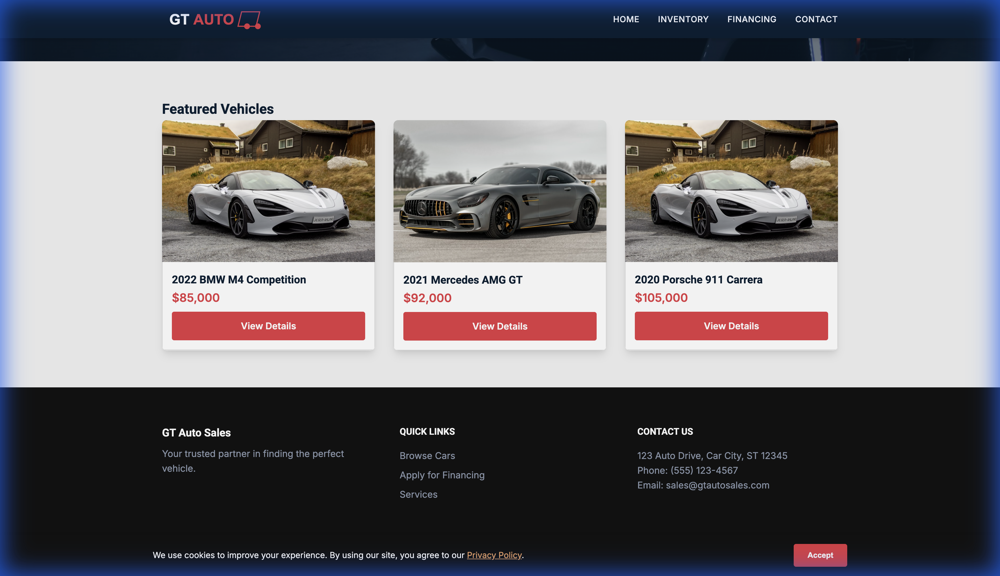
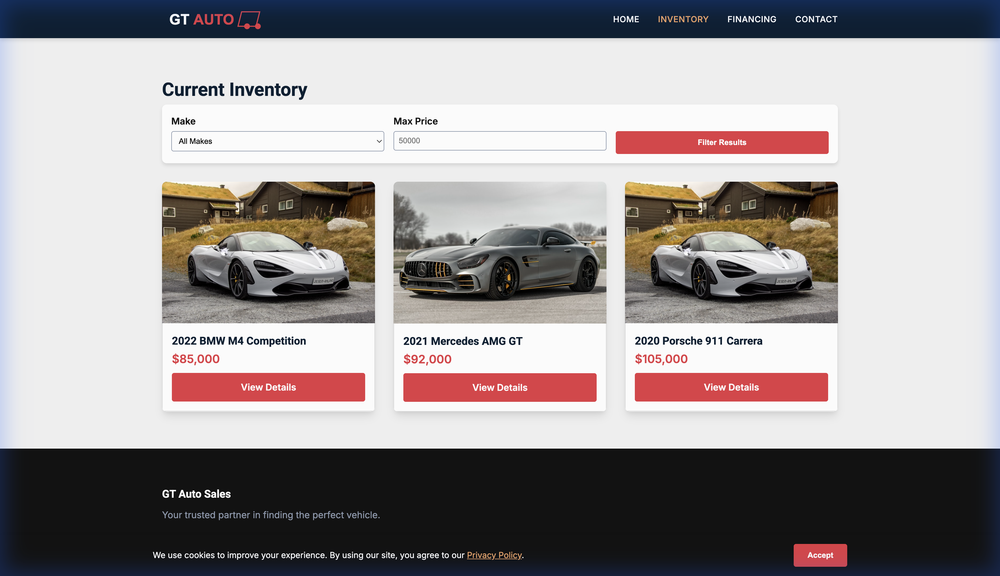
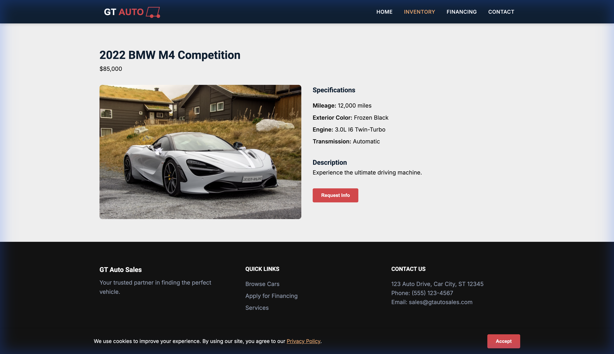

# GT Auto Sales Website

A premium automotive dealership website built with modern HTML5, CSS3, and JavaScript.

## Features
-   **Dynamic Inventory:** Browse vehicles with advanced filtering (Make, Type, Price).
-   **Vehicle Details:** Comprehensive specs, gallery, and financing calculation integration.
-   **Admin Dashboard:** `/admin.html` (Password: `admin123`) for inventory management.
-   **Modular Architecture:** Built with ES Modules and a `VehicleService` layer for data abstraction.
-   **Mobile First:** Fully responsive design for all devices.

## Visual Walkthrough

### 1. Immersive Hero Section
Premium first impression with a dynamic call-to-action.


### 2. Featured Inventory
High-quality vehicle cards with key specs and transparent pricing.


### 3. Dynamic Inventory Grid
Advanced filtering by Make, Model, and Price with real-time updates.


### 4. Detailed Vehicle Pages
Comprehensive specifications, financing calculator (mock), and lead generation forms.


## Setup & Run
1.  **Clone the repository:**
    ```bash
    git clone https://github.com/GarnetGrid/gtautosales.git
    cd gtautosales
    ```
2.  **Run locally:**
    Since the project uses ES Modules, you must run it with a local server.
    ```bash
    # Python 3
    python3 -m http.server 8080 -d src
    
    # Node.js (http-server)
    npx http-server src
    ```
3.  **Visit:** `http://localhost:8080`

## Admin Access
-   URL: `/admin.html`
-   Mock Password: `admin123`
-   *Note: Changes in Admin are currently saved to memory (Mock Mode) and will reset on refresh.*

## Future Roadmap (Phase 4)
-   Integrate Supabase for persistent database storage.
-   Enable live Row Level Security (RLS) for Admin.
-   Deploy Edge Functions for secure logic.

## License
Proprietary - GT Auto Sales
